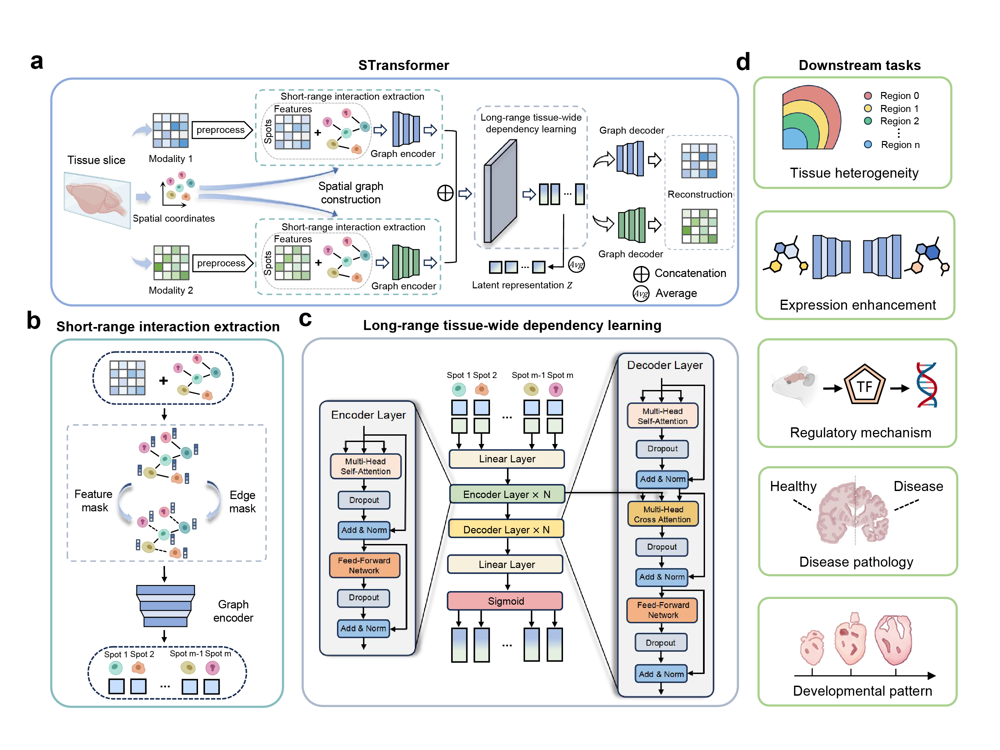

# STransformer

## description



## Getting Started

### dependencies

* Python 3.10.15
* Pytorch 1.12.1
* numpy 1.24.4
* pandas 1.4.4
* scanpy 1.9.8
* scikit-learn 1.3.2
* matplotlib 3.7.5

### How to run

If you want to manually setup STransformer, we recommend you to use [Anaconda](https://docs.anaconda.com/free/anaconda/install/) to build the runtime environment.

Step 1: Clone this repository from Github:

```
git clone https://github.com/xingyili/STransformer.git
cd STransformer
```

Step 2: Extract image features by BYOL (replace with your own data path)：

```
cd ./BYOL
python image_extraction.py
```

Step 3: Run STransformer (example: DLPFC 151507 slice):

```
cd ..
python main.py --cuda 0 --dataset DLPFC --slice_name 151507 --t_epoch 500
```

